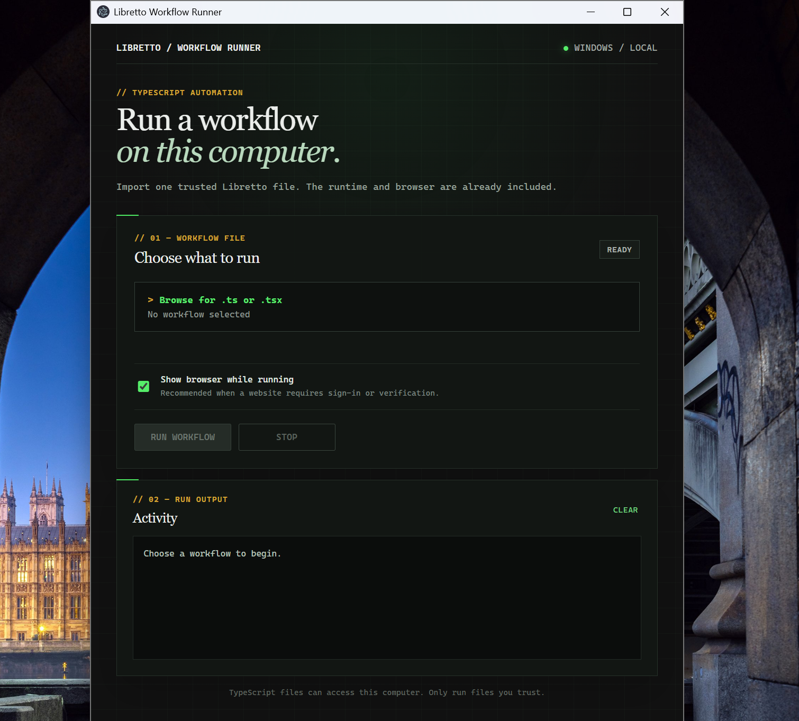

# Libretto Workflow Runner

A Windows desktop application for running trusted Libretto TypeScript workflows.

## Preview



## End-user workflow

1. Install `Libretto Workflow Runner Setup.exe`.
2. Open the application.
3. Choose a `.ts` or `.tsx` workflow file.
4. Select whether the browser should be visible.
5. Click **Run workflow**.

Node.js, npm, pnpm, Libretto, and Playwright do not need to be installed separately on the destination computer. The Windows installer includes the application runtime and Chromium.

Only run TypeScript files you trust. Imported files execute with the same local permissions as the signed-in Windows user.

## Supported files

The recommended format is a default-exported Libretto workflow:

```ts
import { workflow } from "libretto";

export default workflow("example", {
  startUrl: "https://example.com",
  handler: async ({ page }) => {
    return { title: await page.title() };
  },
});
```

A file may also default-export an async function receiving `browser`, `page`, and `log`.

## Development

From the repository root:

```powershell
corepack pnpm install
corepack pnpm desktop-runner:dev
```

The first development run downloads the Chromium build used by Playwright.

## Windows installer

Building the Windows application requires Node.js and Corepack on the development computer. End users do not need them.

Open PowerShell and run:

```powershell
cd "C:\Users\Xiao Admin\Documents\GitHub\libretto"
corepack pnpm install
corepack pnpm desktop-runner:installer
```

The first build downloads Chromium and may take a few minutes. The installable file is written to:

```text
apps\desktop-runner\release\Libretto Workflow Runner Setup 0.0.0.exe
```

Copy that setup file to another Windows computer and run it. The installed application includes Libretto, its TypeScript runtime, Playwright, and Chromium.

### Portable executable

To build an unpacked application without the setup wizard:

```powershell
cd "C:\Users\Xiao Admin\Documents\GitHub\libretto"
corepack pnpm desktop-runner:pack
```

Run the resulting executable from:

```text
apps\desktop-runner\release\win-unpacked\Libretto Workflow Runner.exe
```
